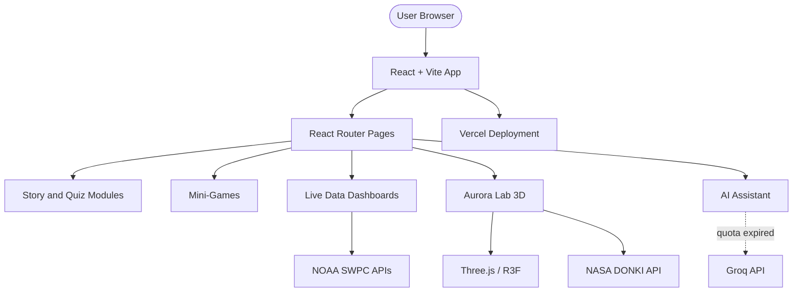

# Solar Storms to Auroras

[](https://exo-visionaries.vercel.app/)
[](https://www.spaceappschallenge.org/2025/find-a-team/exovisionaries/)
[](LICENSE)

> **NASA Space Apps Challenge 2025 — Global Finalist (Top 45 Worldwide)**

An interactive space weather education platform that teaches children about solar storms, auroras, and heliophysics through storytelling, real-time NASA/NOAA data, 3D simulations, and gamified learning.

## Live Demo

**[https://exo-visionaries.vercel.app/](https://exo-visionaries.vercel.app/)**

> **Note:** This experience is optimized for **laptop and desktop** browsers. Mobile and tablet users will see a desktop-only notice.

## Problem Statement

Space weather affects satellites, power grids, astronauts, and everyday technology — yet it remains abstract and difficult for young learners to understand. We built a platform that turns complex heliophysics into an engaging, story-driven journey powered by real scientific data.

## Key Features

| Module | Route | Description |
|--------|-------|-------------|
| **Home** | `/` | Cinematic intro with Astronaut Stelly |
| **Story Journey** | `/start`, `/story2–4` | Progressive solar storm narrative with NASA imagery |
| **Aurora Lab** | `/aurora` | 3D Earth simulation with controllable aurora curtains & NASA DONKI data |
| **Aurora Forecast** | `/forecast` | Live aurora predictions with heatmaps & 24-hour animations |
| **K-Index Dashboard** | `/kindex` | Kid-friendly geomagnetic activity monitoring ("Space Mood") |
| **Electron Forecast** | `/electrons` | Radiation storm predictions & satellite safety data |
| **Quiz** | `/quiz` | Playful assessment with lifelines and educational feedback |
| **StormSafe** | `/stormsafe` | Find-the-shelter time-based challenge |
| **Space Defense** | `/space-defense` | Defend Earth from space threats |
| **AI Q&A** | `/ai-qa` | Space weather assistant *(temporarily offline — API quota expired)* |
| **Data Hub** | `/data` | NASA policy documents, research papers & resources |
| **Finale** | `/finale` | Achievement celebration & completion certificate |

## Screenshots

### Home & Story

| Home Page | Story Journey |
|:---:|:---:|
|  | *Story module preview coming soon* |

### Aurora Lab & Forecast

| Aurora Lab | Aurora Lab — Ground View |
|:---:|:---:|
|  |  |

| Aurora Forecast |
|:---:|
|  |

### Live NOAA Dashboards

| K-Index — Space Mood | Electron Fluence Forecast |
|:---:|:---:|
|  |  |

### Quiz & Games

| Quiz | Space Defense |
|:---:|:---:|
|  |  |

| StormSafe & Mini-Games |
|:---:|
|    |
|    |

## Architecture



## Technology Stack

| Layer | Technologies |
|-------|-------------|
| **Frontend** | React 19, Vite, React Router |
| **Styling** | Tailwind CSS 4 |
| **3D Graphics** | Three.js, React Three Fiber, @react-three/drei |
| **UI** | Radix UI, Lucide Icons, Lottie |
| **State** | Zustand |
| **Data** | NOAA SWPC JSON APIs, NASA DONKI |
| **AI** | Groq API (Llama models) — *currently disabled* |
| **Deployment** | Vercel |

## NASA and NOAA Data Sources

- **Aurora Forecast:** [NOAA Ovation Aurora Latest](https://services.swpc.noaa.gov/json/ovation_aurora_latest.json)
- **Aurora Animations:** [NOAA 24h Animations](https://services.swpc.noaa.gov/products/animations/)
- **K-Index:** [NOAA Boulder K-Index](https://services.swpc.noaa.gov/json/boulder_k_index_1m.json)
- **Electron Fluence:** [NOAA Electron Forecast](https://services.swpc.noaa.gov/json/electron_fluence_forecast.json)
- **NASA Images:** [nasa.gov/images](https://www.nasa.gov/images/)
- **NASA Science:** [science.nasa.gov](https://science.nasa.gov/)
- **Heliophysics Data:** [NASA Heliophysics Portal](https://science.nasa.gov/heliophysics/data/)

## Team — ExoVisionaries

**Institution:** Chittagong University of Engineering and Technology (CUET)  
**Organization:** Andromeda Space and Robotics Research Organisation (ASRRO)

| Member | Role |
|--------|------|
| **Jannatul Naeem Esmi** | Team Leader — Petroleum and Mining Engineering |
| **Shaoli Bose** | Team Member |
| **Priya Dev** | Team Member |
| **Md Habibullah Galib** | Team Member |
| **Asif Hasan** | Team Member — Computer Science and Engineering |

### Recognition and Press

- **[NASA Space Apps 2025 — Global Finalist (Top 45)](https://www.spaceappschallenge.org/2025/find-a-team/exovisionaries/)**
- [Kaler Kantho — CUET team reaches NASA global final](https://www.kalerkantho.com/online/campus-online/2025/11/27/1612014)

> From 1,290 global-stage teams, 45 teams worldwide advanced to the final round — including ExoVisionaries from Bangladesh.

## Getting Started

### Prerequisites

- Node.js 18+
- npm

### Installation

```bash
git clone https://github.com/asifhasan973/ExoVisionaries.git
cd ExoVisionaries
npm install
```

### Development

```bash
npm run dev
```

### Production Build

```bash
npm run build
npm run preview
```

### Environment Variables (Optional)

Create a `.env` file in the project root:

```env
# Re-enable AI assistant when quota is available
VITE_AI_ENABLED=true
VITE_GROQ_API_KEY=gsk_your_key_here
```

## Project Structure

```
ExoVisionaries/
├── src/
│   ├── components/       # Reusable UI and 3D components
│   ├── pages/            # Route-level page components
│   ├── hooks/            # Custom React hooks
│   ├── services/         # API services (AI, etc.)
│   └── data/             # Static quiz and vocabulary data
├── public/
│   ├── aurora-lab/       # Standalone 3D Aurora Lab (Three.js)
│   ├── images/           # Story and game assets
│   └── videos/           # Background videos
├── LICENSE               # MIT License
└── vercel.json           # Deployment config
```

## Known Limitations

- **Desktop only:** 3D modules require laptop/desktop screen sizes
- **AI Assistant offline:** Groq API quota expired; static sample answers provided instead
- **Browser:** Best experienced on Chrome, Firefox, or Edge

## Future Improvements

- [ ] Re-enable AI assistant with renewed API quota
- [ ] Performance optimizations for Aurora Lab
- [ ] Accessibility improvements (keyboard nav, ARIA labels)

## License

This project is licensed under the [MIT License](LICENSE).

---

**Made with love by ExoVisionaries for space education**
